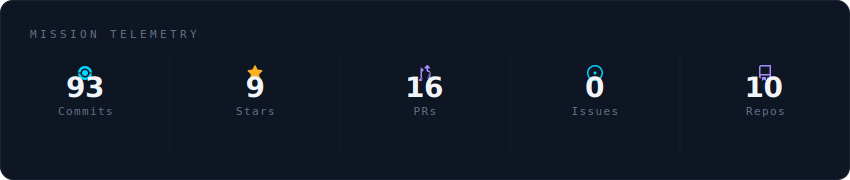

<!-- Galaxy Profile README Template
     Customize this file with your own info, then rename it to README.md
     in your GitHub profile repo (github.com/YOUR_USERNAME/YOUR_USERNAME).
     The SVG paths below point to assets/generated/ which are auto-generated
     by the GitHub Actions workflow or by running: python -m generator.main -->

  

 

  

 

  

 

  

 

<strong>More about me</strong>

 

Criando soluções completas que tornam a vida dos desenvolvedores e usuários mais simples.

Desenvolvedor Full-Stack apaixonado por construir sistemas escaláveis, do back-end ao front-end, com foco em performance, usabilidade e qualidade de código. Experiente em integrar diferentes camadas da aplicação, criando produtos consistentes e eficientes, sempre valorizando a experiência do desenvolvedor e o ecossistema.

**Currently at** Vertigo - Digital Intelligence For Business - Resende, RJ

 

   
   
  
  
  
  

